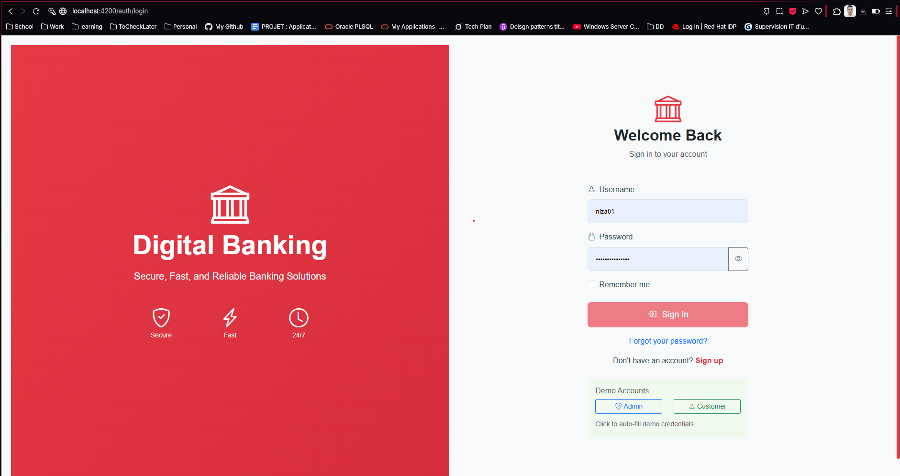

# 🏦 Digital Banking Application

A comprehensive full-stack digital banking solution featuring a Spring Boot REST API backend and Angular frontend with complete authentication, role-based access control, and modern banking operations.


## 🌟 Overview

This Digital Banking Application provides a complete banking solution with separate interfaces for administrators and customers. The system supports all essential banking operations including account management, transactions, transfers, and comprehensive reporting with real-time dashboards.

## ✨ Key Features

### 🔐 Authentication & Security

- **JWT-based Authentication**: Secure token-based authentication system
- **Role-based Access Control**: Separate admin and customer interfaces
- **Spring Security Integration**: Comprehensive security configuration

### 👥 Customer Management

- **Complete CRUD Operations**: Create, read, update, and delete customer data
- **Customer Search & Filtering**: Advanced search capabilities with pagination
- **Customer Status Management**: Active, inactive, suspended, and pending verification states

### 💳 Account Management

- **Multiple Account Types**: Support for Current and Saving accounts
- **Account Creation**: Easy account setup for customers
- **Account Status Control**: Activate, suspend, or close accounts
- **Interest Calculation**: Automatic interest calculation for saving accounts

### 💰 Banking Operations

- **Deposit (Credit)**: Add money to accounts with transaction history
- **Withdrawal (Debit)**: Withdraw money with overdraft protection for current accounts
- **Transfer**: Transfer funds between accounts with validation
- **Transaction History**: Complete transaction history with pagination and filtering

### 📊 Dashboard & Analytics

- **Admin Dashboard**: Comprehensive overview of banking statistics and operations
- **Customer Dashboard**: Personal account overview and recent transactions
- **Real-time Statistics**: Live banking metrics and performance indicators
- **Visual Charts**: Interactive charts for data visualization

### 📚 API Documentation

- **Swagger/OpenAPI 3**: Complete interactive API documentation
- **Comprehensive Testing**: Unit tests, integration tests, and API testing
- **Postman Collection**: Ready-to-use API collection for testing

## 🛠 Technology Stack

### Backend (Spring Boot)

- **Java 21** - Latest LTS version with modern language features
- **Spring Boot 3.4.5** - Latest Spring Boot with enhanced performance
- **Spring Data JPA** - Simplified data access layer
- **Spring Security** - Comprehensive security framework
- **JWT (JSON Web Tokens)** - Stateless authentication
- **H2 Database** - In-memory database for development
- **MySQL** - Production-ready relational database
- **Lombok** - Boilerplate code reduction
- **OpenAPI/Swagger 3** - API documentation and testing
- **JUnit 5** - Modern testing framework
- **Maven** - Dependency management and build tool

### Frontend (Angular)

- **Angular 19** - Latest Angular with standalone components
- **TypeScript** - Type-safe JavaScript development
- **Bootstrap 5** - Modern responsive UI framework
- **Bootstrap Icons** - Comprehensive icon library
- **Chart.js** - Interactive data visualization
- **RxJS** - Reactive programming for Angular
- **JWT Integration** - Seamless authentication handling

## 🖥️ User Interfaces

### 🔑 Authentication

The application provides secure login for both administrators and customers with JWT-based authentication.



### 👨‍💼 Admin Interface

#### Admin Dashboard

Comprehensive overview of banking operations, statistics, and quick actions for administrators.


#### Customer Management

Complete customer management interface with search, filtering, and CRUD operations.


#### Account Management

Account creation and management interface for administrators.


#### Banking Operations

Administrative banking operations including credit, debit, and transfer functionalities.


#### Transaction Management

View and manage all transactions with detailed filtering and pagination.


### 👤 Customer Interface

#### Customer Dashboard

Personal banking dashboard with account overview and quick actions.


#### Account Management

Customer account view and management interface.


#### Banking Operations

Customer banking operations including deposits, withdrawals, and transfers.


#### Transaction History

Complete transaction history with filtering and search capabilities.


## 🚀 Getting Started

### Prerequisites

#### Backend Requirements

- **Java 21** or higher
- **Maven 3.6+**
- **MySQL 8.0+** (optional, H2 included for development)
- **IDE** (IntelliJ IDEA, Eclipse, or VS Code)

#### Frontend Requirements

- **Node.js 18+**
- **npm 9+** or **yarn**
- **Angular CLI 19+**

### Backend Setup (Spring Boot)

1. **Clone the repository**

   ```bash
   git clone <repository-url>
   cd Digital Banking/dig_bank
   ```

2. **Configure Database** (Optional - H2 is configured by default)

   For MySQL, update `application.properties`:

   ```properties
   spring.datasource.url=jdbc:mysql://localhost:3306/digital_banking?createDatabaseIfNotExist=true
   spring.datasource.username=root
   spring.datasource.password=your_password
   ```

3. **Build the application**

   ```bash
   mvn clean compile
   ```

4. **Run the application**

   ```bash
   mvn spring-boot:run
   ```

5. **Access the application**
   - **API Base URL**: `http://localhost:8085`
   - **Swagger UI**: `http://localhost:8085/swagger-ui.html`
   - **H2 Console**: `http://localhost:8085/h2-console` (if using H2)

### Frontend Setup (Angular)

1. **Navigate to frontend directory**

   ```bash
   cd Digital Banking/dig_bank_frontend
   ```

2. **Install dependencies**

   ```bash
   npm install
   ```

3. **Start development server**

   ```bash
   npm start
   # or
   ng serve
   ```

4. **Access the application**
   - **Frontend URL**: `http://localhost:4200`

### Default Credentials

#### Admin Access

- **Username**: `admin`
- **Password**: `admin123`

#### Customer Access

- **Username**: `abdelkrim`
- **Password**: `password123`

## 📚 API Documentation

### Base URL

```
http://localhost:8085/api
```

### 🔐 Authentication Endpoints

| Method | Endpoint         | Description                  | Access |
| ------ | ---------------- | ---------------------------- | ------ |
| POST   | `/auth/login`    | User login with JWT response | Public |
| POST   | `/auth/register` | User registration            | Public |

### 👥 Customer Management Endpoints

| Method | Endpoint            | Description                 | Access     |
| ------ | ------------------- | --------------------------- | ---------- |
| GET    | `/customers`        | Get all customers           | Admin/User |
| GET    | `/customers/{id}`   | Get customer by ID          | Admin/User |
| POST   | `/customers`        | Create new customer         | Admin      |
| PUT    | `/customers/{id}`   | Update customer             | Admin      |
| DELETE | `/customers/{id}`   | Delete customer             | Admin      |
| GET    | `/customers/page`   | Get paginated customers     | Admin/User |
| GET    | `/customers/search` | Search customers by keyword | Admin/User |

### 💳 Account Management Endpoints

| Method | Endpoint                          | Description            | Access     |
| ------ | --------------------------------- | ---------------------- | ---------- |
| GET    | `/accounts`                       | Get all accounts       | Admin/User |
| GET    | `/accounts/{id}`                  | Get account by ID      | Admin/User |
| GET    | `/accounts/customer/{customerId}` | Get customer accounts  | Admin/User |
| POST   | `/accounts/current`               | Create current account | Admin      |
| POST   | `/accounts/saving`                | Create saving account  | Admin      |
| PUT    | `/accounts/{id}/status`           | Update account status  | Admin      |

### 💰 Banking Operations Endpoints

| Method | Endpoint                        | Description                      | Access     |
| ------ | ------------------------------- | -------------------------------- | ---------- |
| POST   | `/accounts/{id}/credit`         | Deposit money                    | Admin/User |
| POST   | `/accounts/{id}/debit`          | Withdraw money                   | Admin/User |
| POST   | `/accounts/transfer`            | Transfer between accounts        | Admin/User |
| POST   | `/accounts/{id}/apply-interest` | Apply interest to saving account | Admin      |
| GET    | `/accounts/{id}/operations`     | Get account operations           | Admin/User |
| GET    | `/accounts/{id}/history`        | Get paginated account history    | Admin/User |

### 📊 Dashboard & Statistics Endpoints

| Method | Endpoint                       | Description            | Access |
| ------ | ------------------------------ | ---------------------- | ------ |
| GET    | `/dashboard/stats`             | Get banking statistics | Admin  |
| GET    | `/dashboard/accounts-summary`  | Get accounts summary   | Admin  |
| GET    | `/dashboard/customers-summary` | Get customers summary  | Admin  |
| GET    | `/dashboard/health`            | Health check           | Public |

### 👨‍💼 Admin-Only Endpoints

| Method | Endpoint                   | Description               | Access |
| ------ | -------------------------- | ------------------------- | ------ |
| GET    | `/admin/users`             | Get all users             | Admin  |
| GET    | `/admin/customers`         | Get all customers (admin) | Admin  |
| GET    | `/admin/users/role/{role}` | Get users by role         | Admin  |
| PUT    | `/admin/users/{id}/status` | Update user status        | Admin  |
| GET    | `/admin/dashboard`         | Get admin dashboard data  | Admin  |

## 🧪 Testing the API

### 1. Using Swagger UI (Recommended)

1. **Start the backend application**

   ```bash
   cd dig_bank
   mvn spring-boot:run
   ```

2. **Open Swagger UI**

   - Navigate to: `http://localhost:8085/swagger-ui.html`
   - Explore and test all endpoints interactively
   - Use the "Authorize" button to authenticate with JWT tokens

3. **Authentication Flow**
   - First, use `/auth/login` endpoint with default credentials
   - Copy the JWT token from the response
   - Click "Authorize" and paste the token (format: `Bearer <token>`)
   - Now you can access protected endpoints

### 2. Using cURL Commands

#### Login and Get JWT Token

```bash
curl -X POST "http://localhost:8085/api/auth/login" \
  -H "Content-Type: application/json" \
  -d '{
    "username": "admin",
    "password": "admin123"
  }'
```

#### Create a Customer (Admin Only)

```bash
curl -X POST "http://localhost:8085/api/customers" \
  -H "Content-Type: application/json" \
  -H "Authorization: Bearer <your-jwt-token>" \
  -d '{
    "name": "John Doe",
    "email": "john.doe@example.com",
    "phone": "1234567890",
    "address": "123 Main Street"
  }'
```

#### Create a Current Account (Admin Only)

```bash
curl -X POST "http://localhost:8085/api/accounts/current" \
  -H "Content-Type: application/json" \
  -H "Authorization: Bearer <your-jwt-token>" \
  -d '{
    "initialBalance": 1000,
    "overDraft": 500,
    "customerId": 1
  }'
```

#### Deposit Money

```bash
curl -X POST "http://localhost:8085/api/accounts/{accountId}/credit" \
  -H "Content-Type: application/json" \
  -H "Authorization: Bearer <your-jwt-token>" \
  -d '{
    "amount": 200,
    "description": "Salary deposit"
  }'
```

#### Transfer Money

```bash
curl -X POST "http://localhost:8085/api/accounts/transfer" \
  -H "Content-Type: application/json" \
  -H "Authorization: Bearer <your-jwt-token>" \
  -d '{
    "accountSource": "ACC001",
    "accountDestination": "ACC002",
    "amount": 100,
    "description": "Transfer to savings"
  }'
```

#### Get Account History

```bash
curl -X GET "http://localhost:8085/api/accounts/{accountId}/history?page=0&size=10" \
  -H "Authorization: Bearer <your-jwt-token>"
```

### 3. Using Postman Collection

A comprehensive Postman collection is available in the repository:

1. **Import Collection**

   - Import `Digital_Banking_API_Tests.postman_collection.json`
   - Or import OpenAPI spec from `http://localhost:8085/v3/api-docs`

2. **Set Environment Variables**

   - `baseUrl`: `http://localhost:8085/api`
   - `token`: Your JWT token (obtained from login)

3. **Test Workflow**
   - Start with authentication endpoints
   - Use admin credentials for full access
   - Test customer operations with customer credentials

### 4. Frontend Testing

1. **Start both applications**

   ```bash
   # Terminal 1 - Backend
   cd dig_bank
   mvn spring-boot:run

   # Terminal 2 - Frontend
   cd dig_bank_frontend
   npm start
   ```

2. **Access the application**
   - Frontend: `http://localhost:4200`
   - Login with provided credentials
   - Test all features through the UI

## 🧪 Running Tests

### Backend Tests (Spring Boot)

#### Run All Tests

```bash
cd dig_bank
mvn test
```

#### Run Specific Test Classes

```bash
# Unit tests
mvn test -Dtest=CustomerControllerTest
mvn test -Dtest=BankAccountControllerTest

# Integration tests
mvn test -Dtest=DigitalBankingIntegrationTest
```

#### Test Coverage

The project includes:

- **Unit Tests**: Controller layer testing with mocked services
- **Integration Tests**: Full application testing with real database
- **API Tests**: Complete workflow testing
- **Security Tests**: Authentication and authorization testing

### Frontend Tests (Angular)

#### Run Unit Tests

```bash
cd dig_bank_frontend
npm test
```

#### Run E2E Tests

```bash
npm run e2e
```

#### Build for Production

```bash
npm run build:prod
```

## 🗄 Database Configuration

### MySQL Database Setup (Production)

1. **Install MySQL** (if not already installed)

2. **Create Database** (optional - will be created automatically)

   ```sql
   CREATE DATABASE digital_banking;
   CREATE USER 'banking_user'@'localhost' IDENTIFIED BY 'secure_password';
   GRANT ALL PRIVILEGES ON digital_banking.* TO 'banking_user'@'localhost';
   FLUSH PRIVILEGES;
   ```

3. **Update Configuration** in `application.properties`:

   ```properties
   # MySQL Production Configuration
   spring.datasource.url=jdbc:mysql://localhost:3306/digital_banking?createDatabaseIfNotExist=true&useSSL=false&serverTimezone=UTC
   spring.datasource.username=banking_user
   spring.datasource.password=secure_password
   spring.jpa.hibernate.ddl-auto=update
   spring.jpa.database-platform=org.hibernate.dialect.MySQL8Dialect
   ```

### H2 Database (Development)

The application is pre-configured with H2 for development:

```properties
# H2 Development Configuration (Default)
spring.datasource.url=jdbc:h2:mem:digital-bank
spring.datasource.driver-class-name=org.h2.Driver
spring.datasource.username=sa
spring.datasource.password=
spring.jpa.database-platform=org.hibernate.dialect.H2Dialect
spring.h2.console.enabled=true
```

**Access H2 Console**: `http://localhost:8085/h2-console`

## 📊 Sample Data

The application automatically creates sample data on startup:

### Default Users

- **Admin User**: `admin` / `admin123`
- **Customer Users**: `abdelkrim`, `soufiane`, `mohamed` / `password123`

### Sample Data Includes

- 3 sample customers with complete profiles
- Multiple accounts (Current and Saving) for each customer
- Sample transactions demonstrating all operation types
- Realistic banking data for testing and demonstration

## 🔧 Configuration

### Application Properties

Key configuration options in `application.properties`:

```properties
# Server Configuration
server.port=8085
server.servlet.context-path=/

# Database Configuration
spring.datasource.url=jdbc:h2:mem:digital-bank
spring.jpa.hibernate.ddl-auto=update
spring.jpa.show-sql=false

# Security Configuration
app.jwt.secret=mySecretKey
app.jwt.expiration=86400000

# Swagger Configuration
springdoc.swagger-ui.path=/swagger-ui.html
springdoc.api-docs.path=/v3/api-docs
springdoc.swagger-ui.operationsSorter=method

# Logging Configuration
logging.level.com.bellagnech.dig_bank=INFO
logging.level.org.springframework.security=DEBUG
```

### Environment Variables

For production deployment, use environment variables:

```bash
export DB_URL=jdbc:mysql://localhost:3306/digital_banking
export DB_USERNAME=banking_user
export DB_PASSWORD=secure_password
export JWT_SECRET=your-super-secret-jwt-key
export JWT_EXPIRATION=86400000
```

## 🚀 Deployment

### Local Development

```bash
# Backend
cd dig_bank
mvn spring-boot:run

# Frontend (separate terminal)
cd dig_bank_frontend
npm start
```

### Production Build

#### Backend JAR

```bash
cd dig_bank
mvn clean package
java -jar target/dig_bank-0.0.1-SNAPSHOT.jar
```

#### Frontend Build

```bash
cd dig_bank_frontend
npm run build:prod
# Files will be in dist/ directory
```

### Docker Deployment

#### Backend Dockerfile

```dockerfile
FROM openjdk:21-jdk-slim

WORKDIR /app

COPY target/dig_bank-0.0.1-SNAPSHOT.jar app.jar

EXPOSE 8085

ENV SPRING_PROFILES_ACTIVE=prod

ENTRYPOINT ["java", "-jar", "app.jar"]
```

#### Frontend Dockerfile

```dockerfile
FROM node:18-alpine AS build

WORKDIR /app
COPY package*.json ./
RUN npm ci

COPY . .
RUN npm run build:prod

FROM nginx:alpine
COPY --from=build /app/dist/dig_bank_frontend /usr/share/nginx/html
COPY nginx.conf /etc/nginx/nginx.conf

EXPOSE 80
```

#### Docker Compose

```yaml
version: "3.8"
services:
  mysql:
    image: mysql:8.0
    environment:
      MYSQL_ROOT_PASSWORD: rootpassword
      MYSQL_DATABASE: digital_banking
      MYSQL_USER: banking_user
      MYSQL_PASSWORD: secure_password
    ports:
      - "3306:3306"
    volumes:
      - mysql_data:/var/lib/mysql

  backend:
    build: ./dig_bank
    ports:
      - "8085:8085"
    environment:
      DB_URL: jdbc:mysql://mysql:3306/digital_banking
      DB_USERNAME: banking_user
      DB_PASSWORD: secure_password
    depends_on:
      - mysql

  frontend:
    build: ./dig_bank_frontend
    ports:
      - "80:80"
    depends_on:
      - backend

volumes:
  mysql_data:
```

## 🏗️ Architecture

### System Architecture

```
┌─────────────────┐    ┌─────────────────┐    ┌─────────────────┐
│   Angular       │    │   Spring Boot   │    │   MySQL/H2      │
│   Frontend      │◄──►│   Backend       │◄──►│   Database      │
│   (Port 4200)   │    │   (Port 8085)   │    │                 │
└─────────────────┘    └─────────────────┘    └─────────────────┘
```

### Security Flow

```
┌─────────────┐    ┌─────────────┐    ┌─────────────┐
│   Client    │    │   JWT       │    │   Spring    │
│   Request   │───►│   Filter    │───►│   Security  │
│             │    │             │    │   Context   │
└─────────────┘    └─────────────┘    └─────────────┘
```

## 🤝 Contributing

1. **Fork the repository**
2. **Create a feature branch**
   ```bash
   git checkout -b feature/amazing-feature
   ```
3. **Make your changes**
4. **Add tests for new functionality**
5. **Ensure all tests pass**
   ```bash
   mvn test  # Backend
   npm test  # Frontend
   ```
6. **Commit your changes**
   ```bash
   git commit -m 'Add some amazing feature'
   ```
7. **Push to the branch**
   ```bash
   git push origin feature/amazing-feature
   ```
8. **Submit a pull request**

### Code Style Guidelines

- Follow Java coding conventions for backend
- Use TypeScript best practices for frontend
- Write comprehensive tests for new features
- Update documentation for API changes
- Use meaningful commit messages

## 📝 License

This project is licensed under the MIT License - see the [LICENSE](LICENSE) file for details.

## 📞 Support

For support and questions:

- **Email**: support@digitalbanking.com
- **GitHub Issues**: [Create an issue](https://github.com/bellagnech/digital-banking/issues)
- **Documentation**: [Wiki](https://github.com/bellagnech/digital-banking/wiki)

## 🎯 Roadmap

### Completed ✅

- [x] JWT Authentication & Authorization
- [x] Role-based Access Control (Admin/Customer)
- [x] Complete Banking Operations (Credit/Debit/Transfer)
- [x] Real-time Dashboard with Charts
- [x] Comprehensive API Documentation
- [x] Angular Frontend with Bootstrap UI
- [x] Complete Test Suite

### In Progress 🚧

- [ ] Email Notifications
- [ ] Advanced Reporting
- [ ] Mobile Responsive Improvements

### Planned 📋

- [ ] Rate Limiting & API Throttling
- [ ] Audit Logging & Compliance
- [ ] Multi-language Support (i18n)
- [ ] Advanced Analytics Dashboard
- [ ] Mobile Application (React Native)
- [ ] Microservices Architecture
- [ ] Redis Caching Layer
- [ ] Kubernetes Deployment
- [ ] CI/CD Pipeline
- [ ] Performance Monitoring

---

## 📸 Screenshots Gallery

### Admin Interface

| Feature             | Screenshot                                                           |
| ------------------- | -------------------------------------------------------------------- |
| Login               |                                      |
| Dashboard           |                     |
| Customer Management |               |
| Account Creation    |  |
| Banking Operations  |           |

### Customer Interface

| Feature            | Screenshot                                                    |
| ------------------ | ------------------------------------------------------------- |
| Dashboard          |        |
| Accounts           |   |
| Transactions       |  |
| Banking Operations |  |

---

